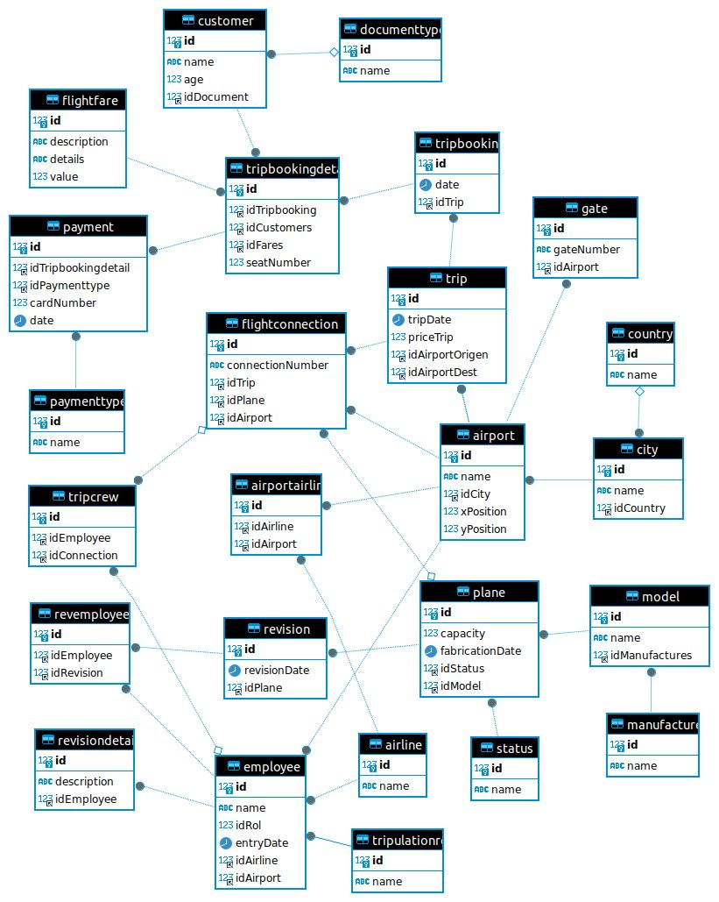

# README

## Introducción
En el mundo actual, el desarrollo de software juega un papel fundamental en asegurar el funcionamiento eficiente y seguro de las aerolíneas. La tecnología ha transformado profundamente la operación aérea, abarcando desde la gestión de vuelos y el mantenimiento de aeronaves hasta la experiencia del cliente. En una industria donde la puntualidad, la seguridad y la satisfacción del cliente son de suma importancia, el software se convierte en un aliado indispensable.

Las aerolíneas enfrentan desafíos significativos que requieren soluciones tecnológicas avanzadas. Entre estos desafíos se incluyen la gestión efectiva de grandes volúmenes de datos, la optimización de rutas de vuelo para mejorar la eficiencia operativa, la implementación de mantenimiento predictivo para aumentar la disponibilidad de aeronaves y la continua mejora de la experiencia del pasajero. Para abordar estos desafíos de manera efectiva, las aerolíneas necesitan contar con sistemas de software robustos, integrados y escalables.

Estos sistemas deben tener la capacidad de determinar las escalas óptimas entre un aeropuerto de origen y destino, encontrando la ruta más eficiente posible. Esta capacidad no solo optimiza los recursos operativos, sino que también mejora la planificación estratégica y la satisfacción del cliente al ofrecer trayectos más directos y eficientes.

## Objetivo General
Implementar un sistema integral de gestión para la aerolínea internacional que optimice y centralice la administración de todos los aspectos operativos y estratégicos de la empresa.

## Metodología
La metodología de cascada, también conocida como modelo en cascada, es un enfoque secuencial y lineal para el desarrollo de software. Se caracteriza por dividir el proceso de desarrollo en etapas bien definidas, donde cada fase debe completarse antes de pasar a la siguiente.

## Fase Análisis
#### Gestión de Aviones y Modelos:
1. **Registrar información sobre los aviones:**
   - Número de matrícula
   - Capacidad
   - Fecha de fabricación
   - Estado
   - Aerolínea
   - Modelo
   - Fabricante
2. **Historial de revisiones de cada avión.**

### Mantenimiento y Revisiones:
1. **Registro detallado de todas las revisiones realizadas a los aviones:**
   - Fecha de la revisión
   - Empleado responsable
   - Detalles específicos de cada revisión

### Gestión de Tripulación:
1. **Administrar datos de los empleados:**
   - Roles
   - Fechas de ingreso
   - Asignaciones a aerolíneas
   - Asignaciones a aeropuertos específicos
2. **Gestionar la asignación de la tripulación a diferentes trayectos y escalas.**

### Gestión de Rutas y Escalas:
1. **Registrar información sobre los trayectos:**
   - Fecha del trayecto
   - Valor
   - Ciudad de origen
   - Ciudad de destino
2. **Gestionar las escalas asociadas a cada trayecto:**
   - Aeropuerto correspondiente
   - Número de vuelo correspondiente

### Reservas y Clientes:
1. **Gestionar la información de las reservas de vuelos:**
   - Fecha de la reserva
   - Trayecto asociado
2. **Mantener un registro detallado de los clientes:**
   - Edades
   - Tipos de documentos
3. **Registrar detalles específicos de cada reserva:**
   - Cliente
   - Tarifa
   - Valor de la tarifa

### Tarifas y Tipos de Documentos:
1. Administrar los diferentes tipos de tarifas de vuelo y sus valores asociados.
2. Gestionar los tipos de documentos de identidad aceptados para los clientes.

## Fase Diseño


### Fase Implementación

#### DDL

```mysql
CREATE DATABASE airport;
USE airport;

CREATE TABLE documenttype(
    id INT(10) PRIMARY KEY AUTO_INCREMENT,
    name VARCHAR(40) NOT NULL);

CREATE TABLE customer(
    id INT(10) PRIMARY KEY,
    name VARCHAR(30) NOT NULL,
    age INT NOT NULL,
    idDocument INT(10),
    CONSTRAINT FK_customersdocument FOREIGN KEY (idDocument ) REFERENCES documenttype(id));

CREATE TABLE country(
	id INT(10) PRIMARY KEY AUTO_INCREMENT,
	name VARCHAR(30) NOT NULL);

CREATE TABLE city(
	id INT(10) PRIMARY KEY AUTO_INCREMENT,
	name VARCHAR(30),
            idCountry INT(5),
           CONSTRAINT FK_countrycity FOREIGN KEY (idCountry) REFERENCES country(id));

CREATE TABLE airport(
    id INT(10) PRIMARY KEY AUTO_INCREMENT,
    name VARCHAR(50) NOT NULL,
     idCity INT(10) NOT NULL,
    xPosition DOUBLE NOT NULL,
    yPosition DOUBLE NOT NULL,
     CONSTRAINT FK_airportcity FOREIGN KEY (idCity) REFERENCES city(id));

CREATE TABLE trip(
    id INT(10) PRIMARY KEY AUTO_INCREMENT,
    tripDate DATE NOT NULL,
     priceTrip DOUBLE NOT NULL,
     idAirportOrigen INT(10) NOT NULL,
     idAirportDest INT(10) NOT NULL,
     CONSTRAINT FK_airport_origen FOREIGN KEY (idAirportOrigen) REFERENCES airport(id),
     CONSTRAINT FK_airport_destint FOREIGN KEY (idAirportDest) REFERENCES airport(id) );

CREATE TABLE paymenttype(
id INT(10)PRIMARY KEY AUTO_INCREMENT,
type VARCHAR(20) NOT NULL
)

CREATE TABLE tripbooking(
    id INT(10) PRIMARY KEY AUTO_INCREMENT,
    date NOT NULL,
    idTrip INT(10) NOT NULL,
    CONSTRAINT FK_tripsbooking FOREIGN KEY (idTrip) REFERENCES  trip(id));

CREATE TABLE payment(
id INT(10) PRIMARY KEY AUTO_INCREMENT,
idTripbooking INT(10) NOT NULL,
idPaymenttype INT(10) NOT NULL,
cardNumber INT(10) NOT NULL, 
date NOT NULL,
  CONSTRAINT FK_tripbooking_pay FOREIGN KEY (idTripbooking ) REFERENCES tripbooking(id),
     CONSTRAINT FK_paymenttype_pay FOREIGN KEY (idPaymenttype) REFERENCES paymenttype(id));

CREATE TABLE flightfare (
    id INT(10) PRIMARY KEY AUTO_INCREMENT,
    description VARCHAR(20) NOT NULL,
    details TEXT,
    value DOUBLE(7, 3) NOT NULL);

CREATE TABLE tripbookingdetail (
    id INT(10) PRIMARY KEY AUTO_INCREMENT,
    seatNumber INT(3) NOT NULL,
    idTripbooking INT(10) NOT NULL,
    idCustomers INT(10) NOT NULL,
    idFares INT(10)  NOT NULL,
    CONSTRAINT FK_detailtripbook FOREIGN KEY (idTripbooking) REFERENCES tripbooking(id),
    CONSTRAINT FK_detailCustomer FOREIGN KEY (idCustomers) REFERENCES customer(id),
    CONSTRAINT FK_detailFares FOREIGN KEY (idFares) REFERENCES flightfare(id));


CREATE TABLE manufacture(
    id INT(10) PRIMARY KEY AUTO_INCREMENT,
    name VARCHAR(30) NOT NULL);

CREATE TABLE model(
    id INT(10) PRIMARY KEY AUTO_INCREMENT,
    name VARCHAR(30) NOT NULL,
     idManufactures INT(10)  NOT NULL,
    CONSTRAINT FK_modelmanufac FOREIGN KEY (idManufactures) REFERENCES manufacture(id));

CREATE TABLE status(
   id INT(10) PRIMARY KEY AUTO_INCREMENT,
   name VARCHAR(30) NOT NULL);

CREATE TABLE plane(
    id INT(10) PRIMARY KEY,
    capacity INT(3) NOT NULL,
    fabricationDate DATE  NOT NULL,
     idStatus INT(10)  NOT NULL,
     idModel INT(10)  NOT NULL,
    CONSTRAINT FK_planestatus FOREIGN KEY (idStatus) REFERENCES status(id),
     CONSTRAINT FK_planemodel FOREIGN KEY (idModel) REFERENCES model(id));

CREATE TABLE airline (
    id INT(10) PRIMARY KEY AUTO_INCREMENT,
    name VARCHAR(30) NOT NULL
);

CREATE TABLE revision(
   id INT(10) PRIMARY KEY AUTO_INCREMENT,
   revisionDate DATE NOT NULL,
   idPlane INT(10) NOT NULL,
   CONSTRAINT FK_revisionplane FOREIGN KEY (idPlane) REFERENCES plane(id));

CREATE TABLE employee (
    id INT(20) PRIMARY KEY,
    name VARCHAR(40) NOT NULL,
    idRol INT NOT NULL,
    entryDate DATE NOT NULL,
    idAirline INT NOT NULL,
    idAirport INT NOT NULL,
     CONSTRAINT FK_employeeAirline  FOREIGN KEY (idAirline) REFERENCES airline(id),
     CONSTRAINT FK_employeeAirport FOREIGN KEY (idAirport) REFERENCES airport(id));
     CONSTRAINT FK_employeeRol FOREIGN KEY (idRol) REFERENCES tripulationRol(id));

CREATE TABLE gate(
   id INT(10) PRIMARY KEY AUTO_INCREMENT,
   gateNumber VARCHAR(10) NOT NULL,
   idAirport INT(10) NOT NULL,
   CONSTRAINT FK_gateAirport FOREIGN KEY (idAirport) REFERENCES airport(id));

CREATE TABLE flightConnection(
     id INT(10) PRIMARY KEY AUTO_INCREMENT,
    connectionNumber VARCHAR(20) NOT NULL,
    idTrip INT(10) NOT NULL,
    idPlane INT(10) NOT NULL,
    idAirport INT(10) NOT NULL,
    CONSTRAINT FK_flightConnTrip FOREIGN KEY (idTrip) REFERENCES trip(id),
    CONSTRAINT FK_flightConnPlane  FOREIGN KEY (idPlane) REFERENCES plane(id),
    CONSTRAINT FK_flightConnAir  FOREIGN KEY (idAirport) REFERENCES airport(id));

CREATE TABLE tripcrew (
    id INT(10) PRIMARY KEY AUTO_INCREMENT,
    idEmployee INT(10),
    idConnection INT(10),
    CONSTRAINT FK_tripcrewEmployee FOREIGN KEY (idEmployee) REFERENCES employee(id),
    CONSTRAINT FK_tripcrewidConnecT FOREIGN KEY (idConnection) REFERENCES flightConnection(id));

CREATE TABLE revemployee (
    id INT(10) PRIMARY KEY AUTO_INCREMENT,
    idEmployee INT(10) NOT NULL,
    idRevision INT(10) NOT NULL,
    CONSTRAINT FK_revemployees FOREIGN KEY (idEmployee) REFERENCES employee(id),
    CONSTRAINT FK_revemployeeRev  FOREIGN KEY (idRevision) REFERENCES revision(id));

CREATE TABLE revisionDetail (
    id INT(10) PRIMARY KEY AUTO_INCREMENT,
    description TEXT NOT NULL,
    idEmployee INT(20) NOT NULL,
    CONSTRAINT FK_DetailEmployee FOREIGN KEY (idEmployee) REFERENCES employee(id));

CREATE TABLE tripulationRol(
    id INT(10) PRIMARY KEY AUTO_INCREMENT,
    name VARCHAR(40) NOT NULL);

CREATE TABLE airportAirline(
    id INT(10) PRIMARY KEY AUTO_INCREMENT,
    idAirline INT NOT NULL,
    idAirport INT NOT NULL,
    CONSTRAINT FK_airportAirline FOREIGN KEY (idAirline) REFERENCES airline(id),
    CONSTRAINT FK_airportairport FOREIGN KEY (idAirport) REFERENCES airport(id));

```

#### Domain Driven Design
### Módulos del Proyecto
El proyecto está dividido en los siguientes módulos, cada uno siguiendo la arquitectura vertical slice:
- airportairline
- city
- country
- customer
- documenttype
- employee
- flightconnection
- flightfare
- gate
- manufacture
- model
- payment
- paymenttype
- plane
- revemployee
- revision
- revisiondetail
- status
- trip
- tripbooking
- tripbookingdetail
- tripcrew
- tripulationrol

### Estructura de Cada Módulo
Cada módulo está estructurado en varias capas, asegurando una clara separación de responsabilidades. A continuación se presenta un ejemplo detallado de la estructura del módulo `airport`:

#### Módulo: `NameModule`
```
|----Adapter
   |--------In
       ModuleConsoleAdapter.java: Maneja la entrada de datos desde la consola y transforma las solicitudes en comandos que pueden ser procesados por la capa de aplicación.
   |--------Out
       ModuleMySQLRepository.java: Implementa la interfaz de acceso a datos, interactuando con la base de datos MySQL para realizar operaciones de CRUD (crear, leer, actualizar, eliminar).
|----Application
   ModuleService.java: Contiene la lógica de negocio del módulo, gestionando las operaciones y coordinando las interacciones entre los distintos componentes.
|----Domain
   Module.java: Define las entidades del dominio, encapsulando el estado y el comportamiento relacionado con los aeropuertos.
|----Infrastructure
   ModuleRepository.java: Define las interfaces y las implementaciones concretas para el acceso a los datos, asegurando que la lógica de negocio no esté acoplada a la tecnología de persistencia específica.
```

## Grafo
### Funcionalidad y Algoritmo
El grafo implementa el algoritmo de Dijkstra para encontrar el camino más corto entre dos aeropuertos dados. Este algoritmo es eficiente para grafos con pesos no negativos y se utiliza ampliamente en aplicaciones de rutas y navegación. El peso de cada arista en este contexto representa la distancia euclidiana entre dos aeropuertos.

## Tecnologías usadas

### 4.3.1 Java

Java es un lenguaje de programación de propósito general, ampliamente utilizado en el desarrollo de aplicaciones empresariales, móviles, juegos, y más. Su portabilidad, robustez, seguridad y facilidad de uso lo convierten en una opción popular entre los desarrolladores.

### 4.3.2 AWS (Amazon Web Services)

AWS es una plataforma de servicios en la nube líder que ofrece una amplia gama de servicios y soluciones para empresas de todos los tamaños. Proporciona escalabilidad, seguridad, confiabilidad y flexibilidad, permitiendo a las empresas innovar rápidamente y escalar según sea necesario.

### 4.3.3 Visual Studio Code

Visual Studio Code es un editor de código fuente ligero y altamente personalizable desarrollado por Microsoft. Es ampliamente utilizado por desarrolladores debido a su amplia gama de extensiones, capacidades de depuración integradas, integración con Git y herramientas de productividad.

### 4.3.4 MySQL

MySQL es un sistema de gestión de bases de datos relacional, encargado de administrar la información de una plataforma de manera que esté disponible tanto para el servidor como para el cliente. Sus ventajas incluyen la protección de datos, facilidad de instalación y administración, y funciones de recuperación y restauración de datos. Sus desventajas incluyen la falta de documentación oficial en algunas utilidades y la necesidad de monitorear el rendimiento de las aplicaciones.

### 4.3.5 Git

Git es un sistema de control de versiones distribuido ampliamente utilizado en el desarrollo de software. Permite a los desarrolladores realizar un seguimiento de los cambios en el código fuente, colaborar con otros miembros del equipo, ramificar y fusionar el código de manera eficiente.
